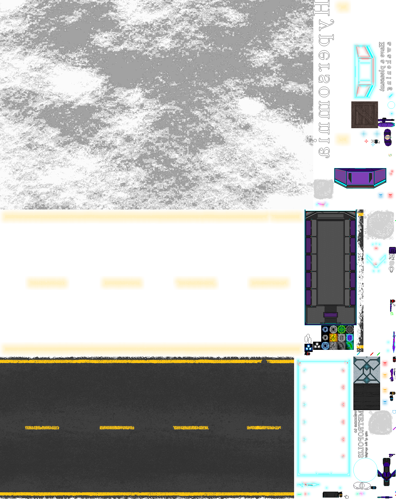
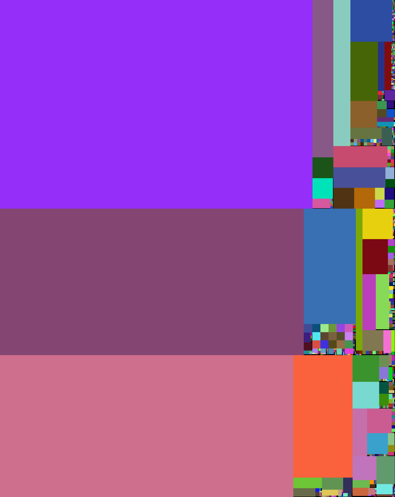
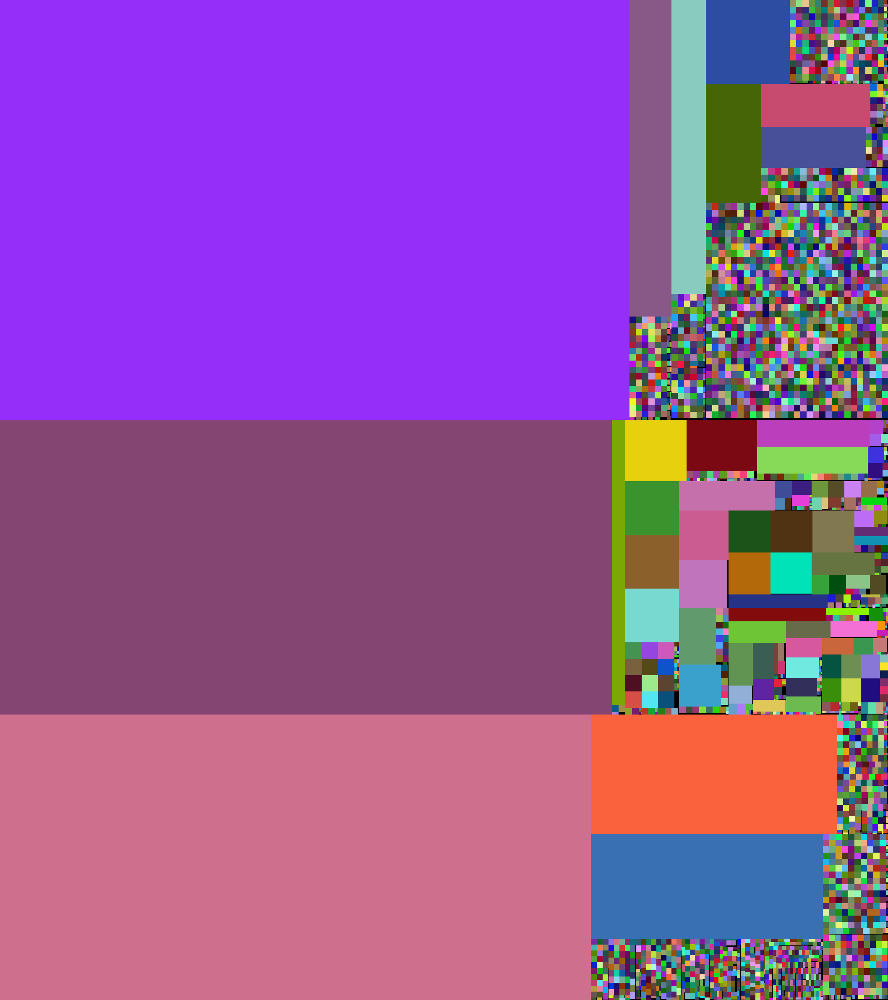

If you are looking for the old version of rectpack2D, it can still be found in [a legacy branch](https://github.com/TeamHypersomnia/rectpack2D/tree/legacy).

# rectpack2D

Rectangle packing library (no longer tiny!).  
This is a refactored and **highly optimized** branch of the original library which is easier to use and customize.  

TODO: Describe the algorithm.

# Example results

### Arbitrary game sprites - 582 subjects.  

**Runtime: 0.8 ms**  
**Wasted pixels: 10982 (1% - equivalent of a 105 x 105 square)**  

Output (1896 x 2382):

In color:  
(black is wasted space)

### Arbitrary game sprites + Japanese glyphs - 3264 subjects.  

**Runtime: 4 ms**  
**Wasted pixels: 15538 (1% - equivalent of a 125 x 125 square)**  

Output (2116 x 2382):

In color:  
(black is wasted space)

# Usage

This is a header-only library.
Just include the ``src/finders_interface.h`` and you should be good to go.

For example use, see ``examples/main.cpp``.
