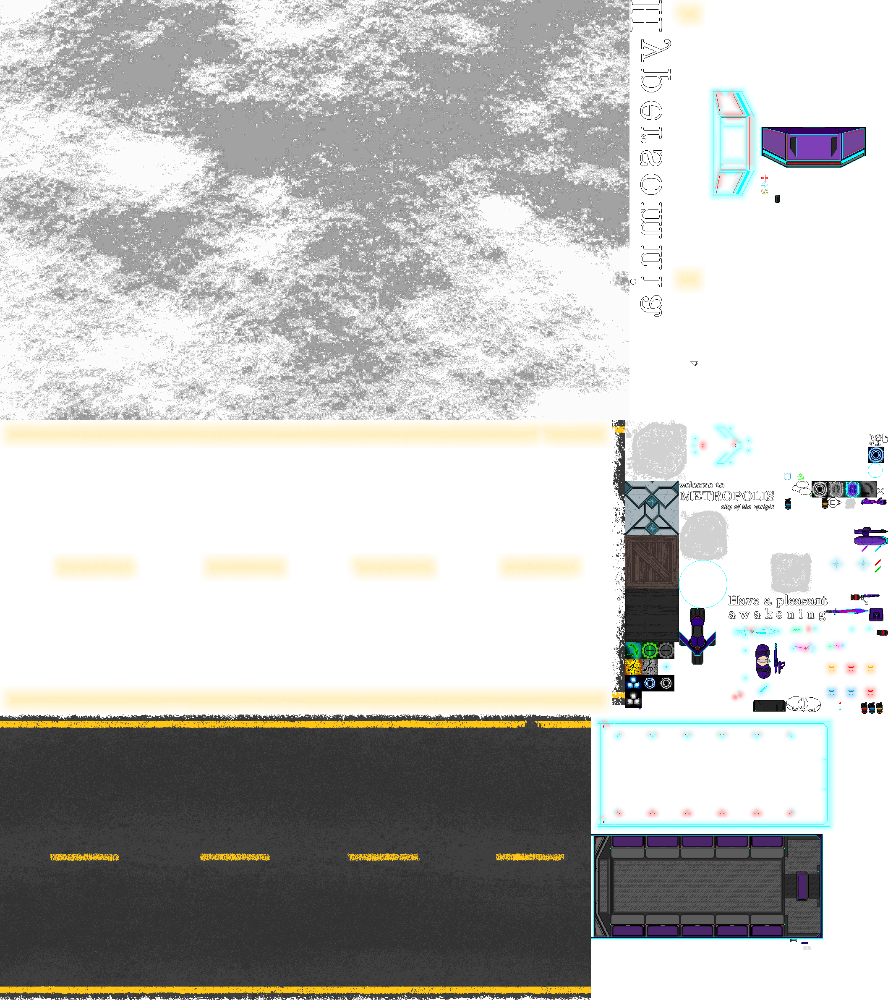
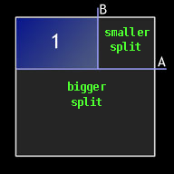

If you are looking for the old version of rectpack2D, it can still be found in [a legacy branch](https://github.com/TeamHypersomnia/rectpack2D/tree/legacy).

# rectpack2D

Rectangle packing library (no longer tiny!).  
This is a refactored and **highly optimized** branch of the original library which is easier to use and customize.  

## Example results

Tests were conducted on a ``Intel(R) Core(TM) i7-4770K CPU @ 3.50GHz``.  
The binary was built with ``clang 6.0.0``, using an -03 switch.

### Arbitrary game sprites: 582 subjects.  

**Runtime: 0.8 ms**  
**Wasted pixels: 10982 (0.24% - equivalent of a 105 x 105 square)**  

Output (1896 x 2382):


In color:  
(black is wasted space)


### Arbitrary game sprites + Japanese glyphs: 3264 subjects.  

**Runtime: 4 ms**  
**Wasted pixels: 15538 (0.31% - equivalent of a 125 x 125 square)**  

Output (2116 x 2382):



In color:  
(black is wasted space)


### Japanese glyphs + some GUI sprites: 3122 subjects.  

**Runtime: 3.5 - 7 ms**  
**Wasted pixels: 9288 (1.23% - equivalent of a 96 x 96 square)**  

Output (866 x 871):


In color:  
(black is wasted space)


## Usage

This is a header-only library.
Just include the ``src/finders_interface.h`` and you should be good to go.

For an example use, see ``example/main.cpp``.

## Algorithm

### Insertion algorithm

The library started as an implementation of this algorithm:

http://blackpawn.com/texts/lightmaps/default.html

The current version somewhat derives from the concept described there -  
however, it uses just a **vector of empty spaces, instead of a tree** - this turned out to be a performance breakthrough.  

Given

```cpp
struct rect_xywh {
	int x;
	int y;
	int w;
	int h;
};
````

Let us create a vector and call it empty_spaces.

```cpp
std::vector<rect_xywh> empty_spaces;
````

Given a user-specified initial bin, which is a square of some size S, we initialize the first empty space.

```cpp
empty_spaces.push_back(rect_xywh(0, 0, S, S));
````

Now, we'd like to insert the first image rectangle.  

To do this, we iterate the vector of empty spaces **backwards** and look for an empty space into which the image can fit.  
For now, we only have the S x S square: let's save the index of this candidate empty space,  
which is ``candidate_space_index = 0;``  

If our image is strictly smaller than the candidate space, we have something like this:



The blue is our image rectangle.  
We now calculate the gray rectangles labeled as "bigger split" and "smaller split",  
and save them like this:  

```cpp
// Erase the space that we've just inserted to, by swapping and popping.
empty_spaces[candidate_space_index] = empty_spaces.back();
empty_spaces.pop_back();

// Save the resultant splits
empty_spaces.push_back(bigger_split);
empty_spaces.push_back(smaller_split);
````

Notice that we push the smaller split *after* the bigger one.  
This is fairly important, because later the candidate images will encounter the smaller splits first,  
which will make better use of empty spaces overall.  

#### Corner cases:

- If the image dimensions equal the dimensions of the candidate empty space (image fits exactly),
	- we just delete the space and create no splits.  
- If the image fits into the candidate empty space, but exactly one of the image dimensions equals the respective dimension of the candidate empty space (e.g. image = 20x40, candidate space = 30x40)
	- we delete the space and create a single split. In this case a 10x40 space.

To see the complete, modular procedure for calculating the splits (along with the corner cases),
[see this source](src/insert_and_split.h).

If the insertion fails, we also try the same procedure for a flipped image.

### Further heuristics

Now we know how to insert individual images into a bin of a given initial size.
Two problems remain unsolved:

- What initial size should be passed to the algorithm so that the rectangles end up wasting the least amount of space?
	- We perform a binary search.
		- We start with the size specified by the library user. Typically, it would be the maximum texture size allowed on a particular GPU.
		- If the packing was successful on the given bin size, decrease the size and try to pack again.
		- If the packing has failed on the given bin size - because some rectangles could not be further inserted - increase the size and try to pack again.
	- The search is aborted if we've successfully inserted into a bin and the dimensions of the next candidate would differ from the previous by less than ``discard_step``.
		- This variable exists so that we may easily trade accuracy for a speedup. ``discard_step = 1`` yields the highest accuracy. ``discard_step = 128`` will yield worse packings, but will be a lot faster, etc.
	- The search is performed first by decreasing the bin size by both width and height, keeping it in square shape.
		- Then we do the same, but only decreasing width.
		- Then we do the same, but only decreasing height.
		- The last two were a breakthrough in packing tightness. It turns out important to consider non-square bins.
- In what order should the rectangles be inserted so that they pack the tightest?
	- By default, the library tries 6 decreasing orders:
		- By area.
		- By perimeter.
		- By the bigger side.
		- By width.
		- By height.
		- By 'a pathological multiplier": ``max(w, h) / min(w, h) * w * h``
			- This makes some giant, irregular mutants always go first, which is good, because it doesn't shred our empty spaces to a lot of useless pieces.
